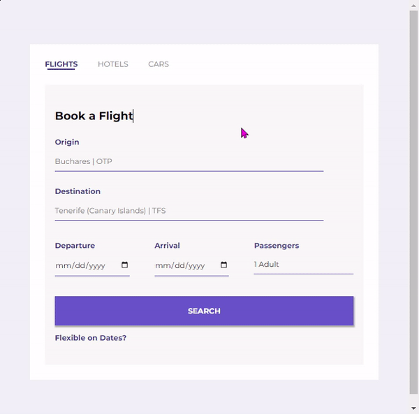

# Flight Booking Form
A booking form that can be used to book flights, hotels and car. This is an iCodeThis challenge.

**Link to project:** https://flight-booking-challenge.netlify.app

## How It's Made:

**Tech used:** 
- HTML
- CSS 
- JavaScript

I created the forms using HTML and styled them using CSS. The interaction is added using JavaScript.

## Optimizations

The challenge was a design and I optimized it by:

- Making it responsive
- adding the interactions

## Lessons Learned:

I learned how to style form elements well. I learned about `appearance: none` and how important it is in styling input elements