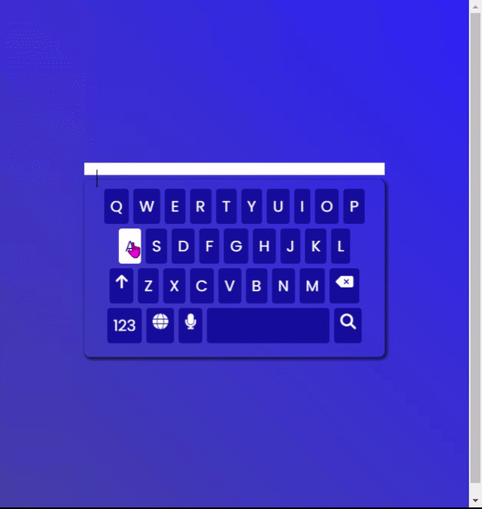

# Keyboard
A keyboard that types into the text box provided.

**Link to project:** https://interactive-keyboard-challenge.netlify.app/

## How It's Made:

**Tech used:** 
- HTML
- CSS 
- JavaScript

I created the keyboard using HTML and styled them using CSS. The typing is added using JavaScript.

## Optimizations

The challenge was a design and I optimized it by:

- DOM Manipulation

## Lessons Learned:

I learned how to use linear gradients.